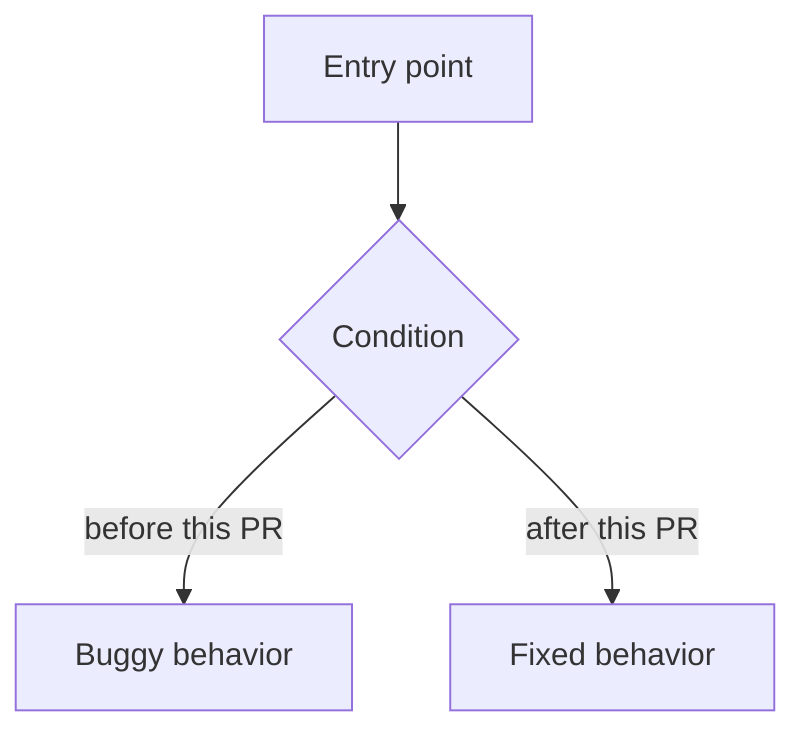

<!-- PR body template — oss-contrib-loop.
     Fill EVERY section in ENGLISH. Keep the upstream template sections
     (reviewers expect them). NEVER fabricate test results — run the
     command, paste the real outcome. -->

## What does this PR do?

<1–3 paragraphs: the problem, the root cause, and why this approach is the
right one. Plain English, no marketing prose.>

### How it works

## Related Issue

Fixes #<N>
<!-- If no issue exists:
"No existing issue — found via mechanical audit; reproduction steps below." -->

## Type of Change

- [ ] 🐛 Bug fix (non-breaking change that fixes an issue)
- [ ] ✨ New feature (non-breaking change that adds functionality)
- [ ] 🔒 Security fix
- [ ] 📝 Documentation update
- [ ] ✅ Tests (adding or improving test coverage)
- [ ] ♻️ Refactor (no behavior change)

## Changes Made

- `path/to/file.py`: <specific change and why>
- `tests/test_x.py`: <test added, what it locks in>

## Step-by-step

<Implementation walkthrough a reviewer can follow without reading the diff first.>

1. <First change and its reason>
2. <Second change>
3. <Test strategy: what fails before, what passes after>

## Acceptance Criteria

<Verifiable, Given/When/Then style. Check a box ONLY after verifying it —
evidence goes in Tests Performed.>

- [ ] Given <initial state>, when <action>, then <expected outcome>.
- [ ] Adjacent behavior <X> is unchanged (regression check).
- [ ] Test suite passes locally with the new tests included.

## How to Test

1. <Reproduction steps on `main` — expected: the bug/limitation shows up>
2. <Check out this branch>
3. <Same steps — expected: fixed/new behavior>

## Tests Performed

| Check | Command | Result |
|---|---|---|
| New unit tests | `<repo test runner> tests/<file> -q` | <real result, e.g. ✅ 4 passed> |
| Targeted suite | `<repo test runner> tests/<area> -q` | <real result> |
| Repo-specific gates | <lint/footgun commands> | <real result> |
| Fail-before/pass-after | New tests run against pre-fix code | <real failing assertion, then pass> |

## Checklist

### Code

- [ ] I've read the upstream Contributing Guide
- [ ] My commit messages follow Conventional Commits
- [ ] I searched existing PRs to make sure this isn't a duplicate
- [ ] My PR contains **only** changes related to this fix/feature
- [ ] I've run the tests and all pass
- [ ] I've added tests for my changes
- [ ] I've tested on my platform: <OS>

### Documentation & Housekeeping

- [ ] Relevant documentation updated — or N/A
- [ ] Config examples updated if config keys changed — or N/A
- [ ] Cross-platform impact considered (Windows, macOS, Linux) — or N/A

## Screenshots / Logs

<Real command output proving the fix — before/after where possible.>
