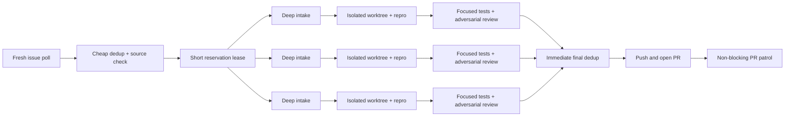

# OSS fast lane — measured first-mover delivery

The fast lane optimizes the time between a real issue becoming visible and a
reviewable PR becoming available. It does not optimize raw PR count and it
never removes a quality gate. A fast lane that increases duplicate closures or
first-pass rejection is a regression.



## Operating contract

1. **Reserve before deep work.** After the cheap metadata filter and a
   source-level sanity check, create a local reservation for a candidate. If
   the target project permits visible work claims, publish one concise claim
   comment; otherwise keep the reservation local. A reservation is not a PR
   promise.
2. **Use a short lease.** The default lease is 25 minutes. Release it as soon
   as the candidate is disproven, already claimed, duplicated, or blocked. Do
   not leave abandoned claim comments behind; mark the release in the daily
   log.
3. **Keep the pool bounded.** Run at most ten independent candidates in
   parallel for a configured batch, or fewer when the project profile,
   newcomer gate, CPU, memory, or open-review queue says so. Same-file
   candidates are serialized.
4. **Separate lanes.** One worker polls fresh issues, one patrols existing PRs,
   and candidate workers operate in isolated branches. Maintainer feedback on
   an existing PR still preempts new intake.
5. **Pipeline, do not serialize.** While candidate A runs its required test
   command, candidate B may perform intake and candidate C may receive review.
   A candidate opens its PR immediately after its own required checks, review,
   and final dedup pass; it does not wait for unrelated candidates or the daily
   report.
6. **Patrol every five minutes.** After the initial batch is opened, re-query
   open PRs and fresh issues every `FAST_LANE_PATROL_MINUTES`. If genuinely new,
   independent issues exist, start a follow-up batch of at most
   `FAST_LANE_FOLLOWUP_BATCH` while continuing to repair feedback and CI.
7. **Measure the race.** Every candidate records `time_to_reserve`,
   `time_to_repro`, `time_to_pr`, `duplicate_lost`, `first_pass_review`, and
   `maintainer_response_hours` when known. The daily log also records
   `merged/opened` and `approved/opened`.
8. **Auto-correct the strategy.** If duplicate losses rise, shorten the
   poll-to-reservation path. If first-pass approval falls, reduce the pool and
   increase review depth. If merge rate falls, disable fast-lane expansion for
   that project until the profile is refreshed.

## Safety boundaries

- The reservation does not bypass issue-first, assignment, CLA, DCO, or
  project-specific policies.
- A red reproduction, missing evidence, failed adversarial review, or final
  dedup hit releases the candidate; it never becomes a speculative PR.
- Only one delivery owner can push/open a candidate PR. Review workers may
  prepare evidence but cannot create competing PRs.
- Never create claim-comment spam, duplicate PRs, or a PR solely to win a race.

## Recommended metrics row

```text
FAST| issue=#NNN reserve=42s repro=310s pr=1180s duplicate_lost=false \
first_pass_review=true maintainer_response_hours=pending
```

Use measured timestamps from GitHub and the run log. If a value is unknown,
write `pending`; never estimate it from memory.
